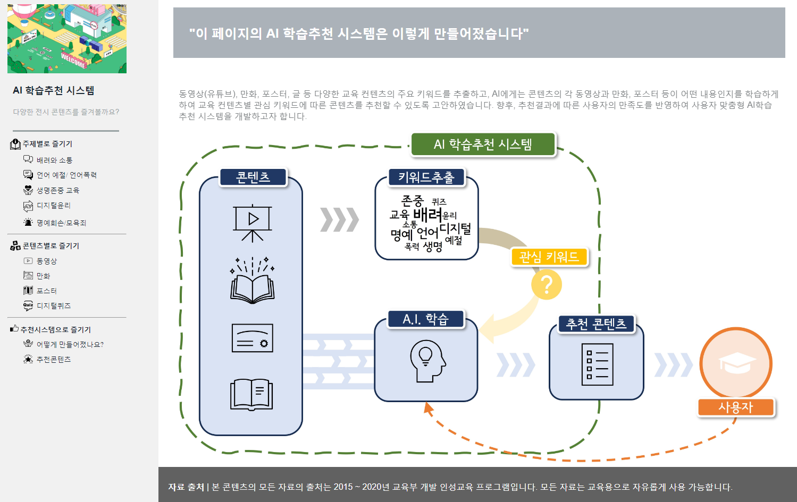

# 한국청소년정책연구원 (NYPI)

<!-- KRIHS Magazine Information -->
 

  
  <h3 align="center">AI 학습 추천 시스템</h3>

  

    이 페이지는 [한국청소년정책연구원]에서 개발한 AI학습추천 시스템으로, 다양한 동영상과 만화, 포스터 등을 기반으로 사용자의 관심에 맞는 콘텐츠를 추전해주는 시스템입니다. R과 Python, HTML 등의 조합을 이용하여 준비하였습니다.
     
    

      <a href="https://ycanns.github.io/NYPI/index.html"><strong>Explore the Webpage! »</strong></a>
     
     
  

